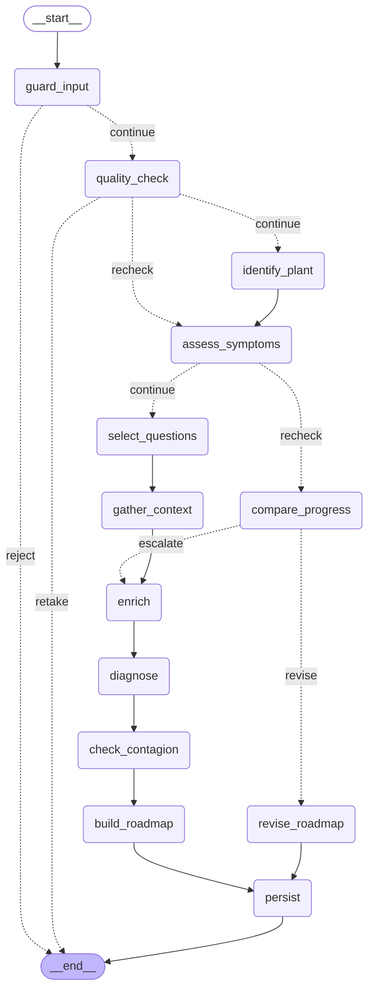
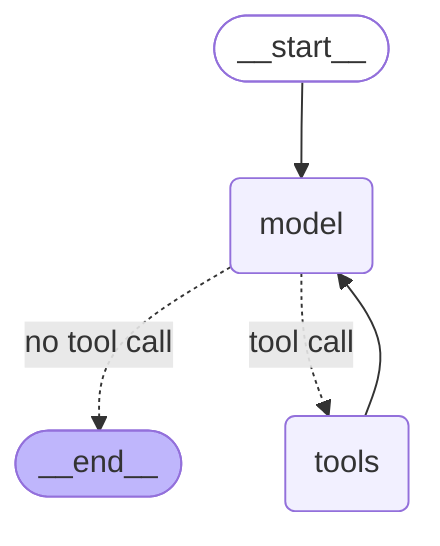

# The agent graphs

Plantopia runs two graphs, not one. The diagnosis pipeline is an explicit state
machine, because two orderings have to be guaranteed — identification precedes
diagnosis, and the clarifying-question interrupt always fires. Chat is a ReAct loop,
because follow-up conversation has no predictable shape. Neither is nested inside the
other: they have separate lifetimes and separate checkpoint files.

Both diagrams below are generated from the graphs themselves — `get_graph()
.draw_mermaid()` on what `agent/diagnosis_graph.py` and `agent/chat_agent.py` build —
rather than drawn by hand, so they cannot quietly disagree with the code. Dotted edges
are conditional; the label is the branch a router returns.

## Diagnosis pipeline



Three things the picture does not say on its own:

- **The interrupt is at `gather_context`.** The run stops there and waits for the
  owner's answers to the clarifying questions; resuming needs a checkpointer, which is
  why every builder call that intends to *run* the graph must pass one.
- **Two paths reach `__end__` early.** `guard_input` rejects an upload that is not
  plant material, and `quality_check` asks for a retake. Both are refusals, not
  failures.
- **A re-check is the same graph on a different route.** `quality_check` sends a
  re-check straight to `assess_symptoms`, skipping identification, and
  `compare_progress` then either revises the existing roadmap or escalates into the
  full differential.

## Chat: the ReAct loop



Built by `langchain.agents.create_agent` in `agent/chat_agent.py`. The cycle is the
whole point: the model either answers, or calls a tool and gets another turn with the
result. Its tools are read-only wrappers over what the diagnosis pipeline already has
— the knowledge base, local weather, a care-profile lookup, this plant's journal —
plus `suggest_new_diagnosis`, which is how the agent declines to diagnose from text
alone and hands back to the wizard.

## Opening these in LangGraph Studio

Studio is no longer a separate application: a local API server serves the graphs and
Studio renders them inside LangSmith.

```bash
uv run langgraph dev
```

That reads `langgraph.json`, imports the factories in `agent/studio.py`, and serves
both graphs on `http://127.0.0.1:2024`. It opens a browser at the Studio URL for you.
On the **EU** LangSmith instance — which is where this project's key lives — the URL is:

```
https://eu.smith.langchain.com/studio/?baseUrl=http://127.0.0.1:2024
```

Pick `diagnosis` or `chat` from the graph selector. Studio draws the topology, and can
run a thread, stop at the interrupt, show state at every step, and fork from any point.

Two things worth knowing before pressing run:

- **`langgraph dev` loads `.env`**, so a run in Studio uses the real OpenRouter key and
  costs real money, exactly as the app does. Looking at the diagram costs nothing.
- **The chat graph needs to know which plant.** It reads `plant_id` from the run's
  config; set it in Studio's configuration panel, or leave it and the newest plant is
  used.
